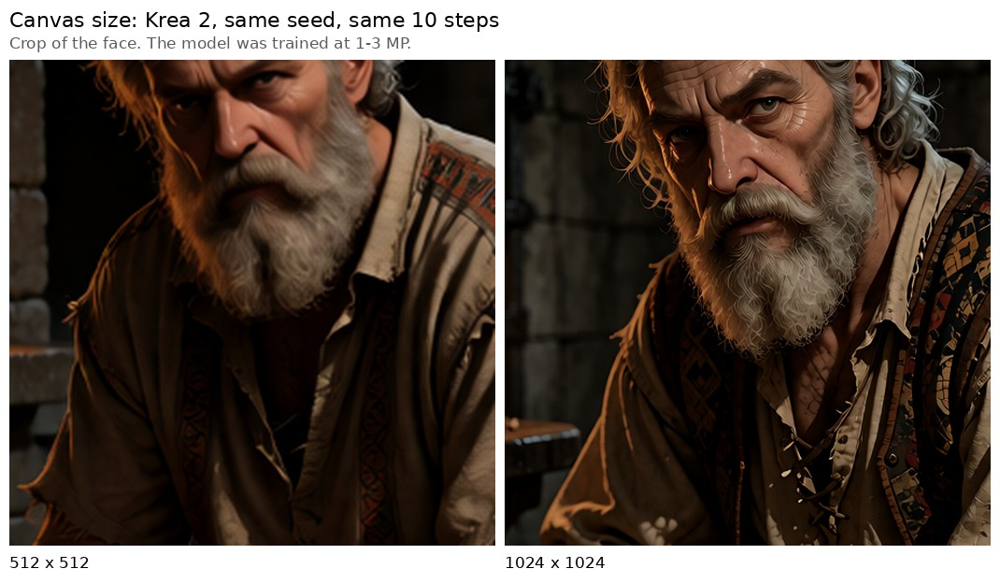
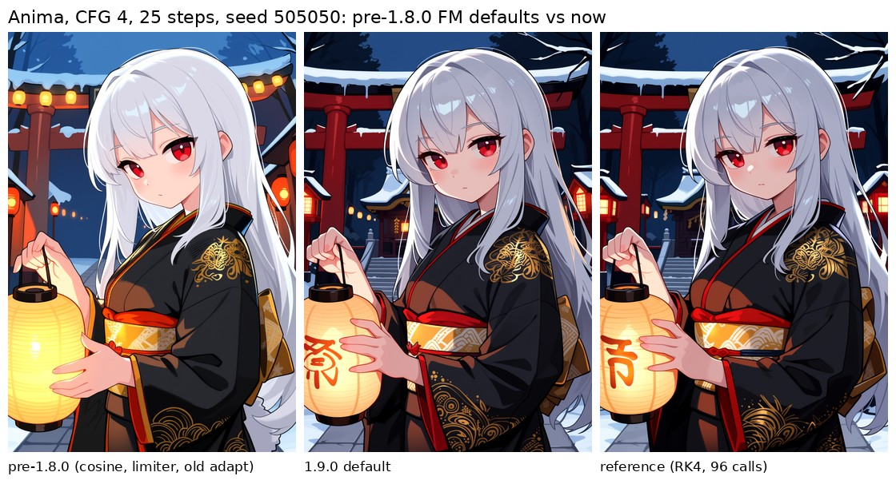
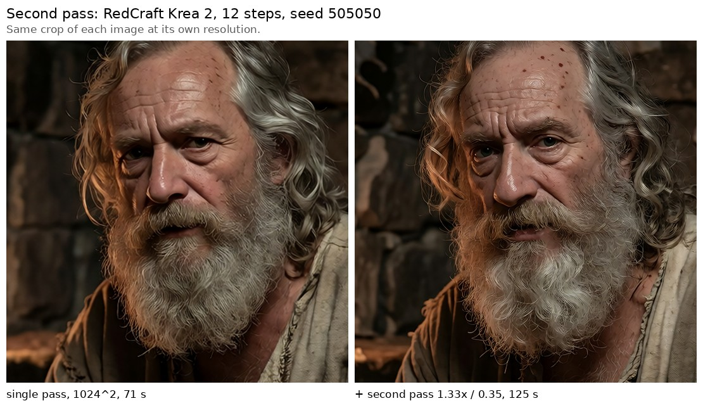
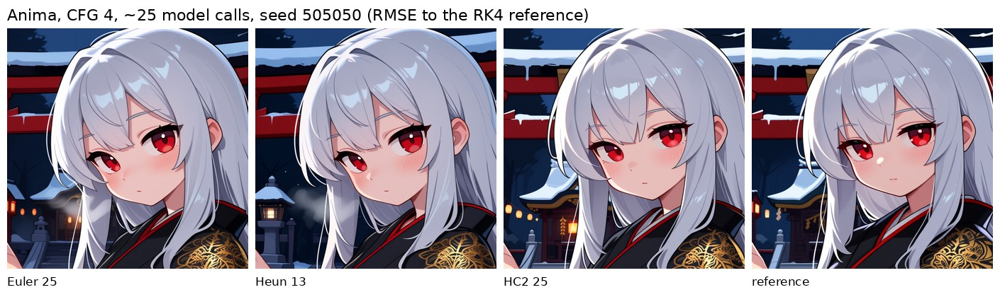

<div align="center">


# DDRK Omega Sampler

**D**omain-adaptive **D**iffusion **R**obust **K**ernel

*One sampler node for Flow Matching and EDM models alike.*

[](https://github.com/comfyanonymous/ComfyUI)
[](https://www.python.org/)
[](LICENSE)
[](#changelog)

</div>

---

## Overview

DDRK Omega is a single sampler node that handles **Flow Matching** models (Flux, SD3, Qwen, Krea, HiDream, Chroma, Lumina) and **EDM** models (SDXL, SD 1.5, SD 2) without switching samplers or relearning parameters per family. It detects the family from the sigma schedule and recalibrates internally.

The goal is a node you drop in and use — not one you tune for an hour per checkpoint.

Version 1.7.0 added **DDRK Omega Lite**, a thin preset-driven wrapper for ordinary use. Version 1.9.0 is the first release validated on real images rather than only by CPU tests: it adds a **second pass** (latent-space hires fix) and fixes Flow Matching noise injection - see [Measured on images](#measured-on-images-190).

<div align="center">

| | |
|:--|:--|
| **HC2 integrator** | Second order at 1 model call/step — Heun quality at roughly half the compute on Flow Matching |
| **Adaptive phase routing** | Three phases, each with its own integrator policy and post-processing |
| **Ancestral SDE** | Calibrated noise split (Karras et al. 2022), gated to flat regions |
| **Per-step telemetry** | Opt-in JSON + CSV + summary logs of every internal decision |
| **Family auto-detection** | Schedules, integrator and enhancer defaults resolved per model family |

</div>

---

## Installation

```bash
cd ComfyUI/custom_nodes/
git clone https://github.com/HVOSTOVSKY/DDRK-Omega-Sampler.git
```

Restart ComfyUI. No dependencies beyond what ComfyUI already requires.

---

## Quick start

For the shortest setup, use **DDRK Omega Lite**. Connect the model, conditioning and latent, choose steps/CFG as the checkpoint recommends, then leave `quality = balanced` and `character = neutral` until you want a deliberate trade-off. On Flow Matching, `quality = best` adds the second pass: noticeably more detail for roughly 1.7x the time.

Use the model's native resolution (about 1 MP for Flux, Krea 2, Qwen, SDXL). Nothing in a sampler recovers what a 512x512 canvas cannot hold - see the first comparison below.

Use **DDRK Omega Unified KSampler** when you need direct access to schedules, HC2 controls, SDE, SABER, restarts, or telemetry. The full node remains unchanged and available alongside Lite.

---

## Measured on images (1.9.0)

Bench: one process loads the model once and runs every variant with the same seed, prompt and resolution; each image is compared by eye and by RMSE to a high-accuracy reference of the same seed (RK4, 24 steps = 96 model calls; lower RMSE = closer to the exact solution of the same ODE). Models: RedCraft Krea 2 (FM, distilled, 12 steps, CFG 1, 1024x1024, 3 seeds) and MolKeunMix Anima (FM, 25 steps, CFG 4, 832x1216, 2 seeds). Hardware: RTX 2070 8 GB. All sheets are in [`docs/ab-1.9.0/`](docs/ab-1.9.0/).

**Canvas size matters more than any sampler setting.**



**The pre-1.8.0 Flow Matching defaults washed images out.** Cosine schedule + `auto_flow_shift` + limiter 0.995 + the old `sigma_adapt` controller: RMSE to the reference **0.286 / 0.281**, against **0.108 / 0.155** for the current defaults.



**The second pass adds real detail** (1.33x, denoise 0.35): on every seed of both models, without changing the composition. Cost on an RTX 2070: Krea 2 12 steps went from 71 s to 125 s; peak VRAM 7.1 GB at 1360x1360.



**HC2 is the most accurate integrator at equal model calls where it matters** (Anima, CFG 4, ~25 calls):

| Integrator | Calls | RMSE seed 5050 | RMSE seed 505050 |
|:--|--:|--:|--:|
| Euler, 25 steps | 25 | 0.123 | 0.210 |
| Heun, 13 steps | 25 | 0.123 | 0.230 |
| **HC2, 25 steps** | 25 | **0.108** | **0.155** |



On the distilled Krea 2 at 12 steps and CFG 1 the three integrators were visually close. The integrator matters where the trajectory is hard.

**`hc2_space = flow` is a draw on images.** It is the exact FM parameterisation of HC2's correction (below), and on the analytic FM problem it is more accurate from 10 steps up but less accurate at 6-8. On images it was 0.106 vs 0.108 on one seed and 0.165 vs 0.155 on the other. It ships opt-in; `ve` stays the default.

---

## What is actually verified

This section exists because it is easy for a project like this to accumulate claims. Image-path results below were measured with the built-in telemetry on real generations across five checkpoints (Anima, Krea2, Qwen, Illustrious, PonyXL); convergence orders were measured separately on the stated synthetic ODE.

### Measured

**Integrator convergence.** On the semi-linear test ODE with a known solution, the measured convergence orders are: Euler **1.02**, Heun **2.03**, RK4 **4.02**, HC2 order 2 **2.01**, and HC2 order 3 **3.11**. At an equal budget of 32 model calls, HC2 order 2 is **13.8x more accurate than Heun**, and HC2 order 3 is **11x more accurate than RK4**. These are numerical integration results, not an image-quality score.

**HC2 vs Heun on Flow Matching, equal compute.** HC2 at 20 steps (20 calls) vs Heun at 10 steps (19 calls), three seeds, every enhancer at zero: HC2's final latent held a **16-25% wider dynamic range on all three seeds**, mean +21%. The same metric had previously separated Euler from Heun/RK4 and matched blind visual judgement both times.

**HC2 vs Heun on Flow Matching, equal step count.** Both at 8 steps on a cosine schedule, three seeds: HC2 matched or beat Heun on 2 of 3 seeds (mean +5% range) while using **9 model calls against 15** and finishing roughly 40% faster.

**HC2 does not lean on the enhancer stack.** Turning sharpening, SDE and SABER off moved HC2's result by +0.2% while Heun's dropped 4.6%. HC2's detail comes from the integration, not from filters applied afterwards.

**Integrator ordering on Flow Matching at equal compute.** Euler came last on all three seeds, both by eye and by dynamic range, which ran 12-17% narrower than Heun/RK4.

**Stability and reproducibility.** No NaN or Inf across every logged run. Identical inputs reproduce identical output; residual variation between runs is ~1e-7 and comes from non-deterministic GPU kernels, not from the sampler.

### Measured, and negative

**HC2 shows no advantage on EDM.** Illustrious, three seeds, equal settings: mean range difference +1.2%, and HC2 used 10% more model calls to get it. On EDM, Heun or `auto` remains the sensible choice.

A plausible explanation: HC2 assumes the denoiser varies smoothly in lambda = -log(sigma). The Karras EDM schedule is already close to uniform in lambda, so it does much of that work already. Flow Matching schedules cannot be uniform in lambda — sigma reaches exactly zero, so lambda diverges — which is where an exponential integrator has the most to offer. **This explanation is plausible but not proven**, and it cannot be tested directly on Flow Matching for the same structural reason.

**The selective corrector did not show a consistent measurable gain.** It remains opt-in and off by default. **Adaptive step placement did:** `sigma_adapt=0.10` was the largest single measured gain (+3.3% dynamic range), while the response saturates above 0.20 and higher values can hurt. **That measurement is of the pre-1.8.0 controller, which live telemetry showed was sign-inverted** (it lengthened the step after a high-error step, raised the last non-zero sigma by 10% and produced near-empty steps). 1.8.0 fixes the controller; the fixed version has not yet been compared on images, and the dynamic-range gain may have been the larger final jump rather than better detail.

**SABER consistently narrows dynamic range.** It is a deliberate smoothing control with a real cost and is not a default in Lite. Repeated external reports of a SABER memory leak were investigated and rejected as false positives; no leak workaround is applied.

**Small SDE strengths were indistinguishable from off.** Values from 0.08 through 0.15 stayed within 0.2% of the deterministic dynamic range in the measured runs. **The old sharpness cap was binding, not a plateau:** 0.12 still increased the measured effect, so larger values remain reachable but unvalidated.

### Not verified

- Cross-enhancer interactions and AB2 extrapolation have not been fully ablated. SABER, SDE, sharpening, and sigma adaptation do have the individual measurements stated here; unlisted combinations remain starting points rather than tuned optima.
- HC2's third-order mode is mathematically verified on synthetic ODEs but rarely accepted on real trajectories at low step counts, and has not been shown to improve images.
- Dynamic range is a proxy metric. It tracked visual quality in every comparison where the difference was obvious, and stopped discriminating on subtle ones.
- GPU image quality is not automatically tested; CPU tests verify numerics, invariants, shape handling, and wrapper equivalence.

---

## The HC2 integrator

### What it is

The core is an **exponential (semi-linear) multistep method** — the same family as DPM-Solver++(2M) and UniPC. That part is published mathematics, not invented here. The slope limiter and the measured-error order selection built on top are specific to this sampler.

### Why it beats Heun per model call

The sampling ODE is `dx/dsigma = (x - D(x, sigma)) / sigma`. It is *linear in x*, with all the difficulty living in the denoiser `D`. Euler on it already integrates the linear part exactly — the update reduces to DDIM. Euler's only error is treating `D` as constant across the step.

Heun and RK4 spend their extra model calls re-approximating the whole right-hand side, including the linear part that needed no approximating, and they evaluate `D` at intermediate points on a *predicted* trajectory, so those evaluations carry their own error.

HC2 keeps the exact linear solve and approximates `D` as linear in lambda = -log(sigma), using the previous step's evaluation — already exact, already paid for, no prediction required:

```
x_next = e^(-h) * x  +  (1 - e^(-h)) * D_n  +  limit( r * [(h - 1) + e^(-h)] )

    h = log(sigma_n / sigma_next)        r = (D_n - D_prev) / h_prev
```

The first two terms are Euler/DDIM. The third is the correction, whose coefficient behaves as `h^2/2` for small `h` — second order, at **one** model call per step.

### The slope limiter

`r` is an extrapolation from past data. Under high CFG the denoiser swings hard between steps and an unlimited extrapolation overshoots — the classic oscillation of high-order schemes near a sharp feature.

Finite-volume CFD solved this decades ago with slope limiters: keep full accuracy where the solution is smooth, drop toward first order where it is not, decided per element. Here the correction is capped elementwise at `limiter_kappa x` the magnitude of the first-order step. Unlike a clamp on latent values, this never touches the output range, so it costs no contrast.

In practice the limiter engages on 1-3% of elements on a typical step, rising to ~28% on the first step with history. It intervenes, it does not dominate.

### Order selection

With `hc2_max_order = 3`, HC2 fits a quadratic through three past evaluations and compares the third-order term against the second. If each successive term is smaller, the expansion is behaving and the extra order is used; if the third rivals the second, the fit is being driven by noise in `D` rather than real curvature, and HC2 falls back to second order. Both the ratio and the order chosen are logged.

Third order also pays one extra model call on the first step. A multistep method's first step is first-order, and that single step otherwise caps the entire run at second order — measured: cold start converged at 4x per halving, seeded start at 7.7x toward the theoretical 8x.

---

## Architecture

```
PHASE 1  (~55% FM / ~65% EDM of steps)
    Integrator chosen per step in auto mode, or pinned
    FM   ancestral SDE injection, gated to flat regions
    EDM  optional churn (Karras Alg. 2), SABER at very high sigma

PHASE 2  (~35% FM / ~22% EDM)
    Integrator per phase policy
    FM   SABER spatial fusion
    EDM  no SABER - mid-step blur shifts anatomy

PHASE 3  (remainder)
    Euler in auto mode
    FM   final perceptual sharpen on the last step
    EDM  no sharpen
```

**Adaptive integrator order.** In `auto` mode, phase 1 picks per step from a curvature measure: the fractional change of the denoiser output over the previous step. Because it is dimensionless, one pair of thresholds is valid on both families — an earlier version divided by the sigma step, which made the same quantity read ~0.6 on EDM and ~17 on FM.

**Ancestral SDE split.** A step from sigma to sigma_next decomposes into a shorter deterministic step to sigma_down plus noise of standard deviation sigma_up, calibrated so the combined variance reproduces sigma_next's marginal exactly (Karras et al. 2022). The spatial gating on top — noise only into flat, low-detail regions — is this sampler's own texture-preservation heuristic, not part of that derivation.

**Soft clamp.** EDM only, bound tied to the noise level (`max(4*sigma, 10)`) rather than a constant. A constant bound was clipping ~39% of the tensor at high sigma — ordinary early noise, not divergence. Flow Matching gets no per-step clamp at all; both families keep a wide final guard against actual blowups.

**Edge detection.** The LoG mask flags pixels whose local curvature exceeds the background level, estimated robustly from the median. A percentile cutoff was used before and was tautological — it marked a fixed 20% of every tensor as "edge" regardless of content, including at step 0 where the latent is still pure noise.

**Reproducibility.** SDE noise and EDM churn draw from one seeded generator. With `sde_seed = -1` the seed derives from the global RNG, which ComfyUI seeds from the workflow seed, so runs repeat from the seed widget alone.

---

## Nodes

| Node | Purpose |
|:--|:--|
| **DDRK Omega Lite** | Thin preset wrapper over the Unified node. Five adjustable controls: seed, steps, CFG, quality, and character. Start here for ordinary use. |
| **DDRK Omega Unified KSampler** | Full all-in-one replacement with every schedule, integrator, enhancer, and diagnostic control. |
| **DDRK Omega Sampler** | Returns a `SAMPLER` object for use with `SamplerCustom`. |
| **DDRK Omega Scheduler** | Returns a `SIGMAS` schedule only. Also exposes `beta_a` / `beta_b`. |
| **DDRK Omega Smart Config** | Introspection: detected family, hint text, `guidance_embed`, recommended settings. Deliberately does not guess steps or CFG. |

### DDRK Omega Lite mapping

Lite calls the same Unified node and the same `sample_ddrk_omega` implementation; it does not contain a second sampler. `ddrk_auto` selects the family-appropriate schedule, denoise is 1.0, auto-optimization and stochastic features are off, and all unlisted full-node controls use the values shown below. Tests compare every quality/character combination against the equivalent full-node configuration with `torch.equal`.

**Quality**

| Model family | Fast | Balanced (default) | Best |
|:--|:--|:--|:--|
| Flow Matching | HC2 order 2, `sigma_adapt=0` | HC2 order 2, `sigma_adapt=0.10` | HC2 order 2, `sigma_adapt=0.10`, second pass 1.33x |
| EDM | Euler, `sigma_adapt=0` | Heun, `sigma_adapt=0` | RK4, `sigma_adapt=0` |

**Euler is deliberately absent from the Flow Matching row.** HC2 order 2 costs exactly the same one model call per step as Euler, and on the analytic convergence problem it was more accurate at every step count tested - 4x better at 2 steps, 21x at 3, 17x at 8, 41x at 20. There is no step count at which Euler is the better trade on FM, so no quality level offers it.

Because of that, the FM quality dial is **not a speed control** - all three levels cost one model call per step, apart from a single extra bootstrap call at `best`. The speed control is the steps widget. The dial trades numerical aggressiveness.

Since 1.9.0, `best` on FM is `balanced` plus the **second pass** (1.33x upscale, denoise 0.35, about 40% of the base steps and at least 4). It replaced HC2 order 3, which live telemetry showed was accepted on one step in nine and never produced a visible gain. `best` is therefore the one FM quality level that costs more time - about 1.7x in the measurements above.

HC2 is deliberately absent from the EDM row: controlled testing found **no HC2 advantage on EDM**. “Best” identifies the highest-compute preset in this small interface; it is not a claim that every model or step count will produce a visually superior image. The EDM row is inherited from the family defaults and has **not** been compared at equal compute - RK4 spends four model calls per step.

**Character**

| Choice | Sharpness | SABER fusion | Meaning |
|:--|--:|--:|:--|
| Neutral (default) | 0.00 | 0.00 | No stylistic enhancer |
| Sharp | 0.12 | 0.00 | Measured sharpness setting; FM only |
| Smooth | 0.00 | 0.10 | Deliberate SABER smoothing with its measured dynamic-range cost |

On EDM, `sharp` is bit-identical to `neutral` because sharpening is disabled for that family by design. SABER is never a default: it consistently narrows dynamic range and is exposed only through the explicit `smooth` choice.

**Fixed Lite controls:** `sde_strength=0`, `s_churn=0`, `restart_repeats=0`, `momentum_beta=0`, `dyn_thresh_percentile=1.0` (off since 1.8.0), `limiter_kappa=1.0`, `hc2_corrector=0`, `latent_rescale=0`, `content_aware=true`. (`hc2_max_order` is set by the quality dial, see above.)

### Schedulers

| Scheduler | Family | Notes |
|:--|:--|:--|
| `ddrk_auto` | both | EDM: `ddrk_edm_karras`. FM: `ddrk_model` (since 1.8.0; it used to be `ddrk_cosine`). Recommended. |
| `ddrk_model` | both | The model's own schedule: `comfy.samplers.calculate_sigmas(model_sampling, "simple", steps)`. The shift comes from the model and any `ModelSampling*` node in the graph; `flow_shift` / `auto_flow_shift` are ignored. Falls back loudly to `ddrk_flow_linear` / `ddrk_edm_karras` when no model sampling is available. |
| `ddrk_cosine` | FM | Cosine decay. Densest at sigma ~1: with a shift on top, the first steps are near-empty and the final jump is large (live Krea 2: 0.37-0.40 to zero at 1 MP). Not used by `ddrk_auto` any more. |
| `ddrk_beta` | FM | Shaped by `beta_a` / `beta_b`; defaults 2.0 / 1.0 give Karras-like shrinking steps |
| `ddrk_flow_linear` | FM | Linear with shift |
| `ddrk_flow_cosmos` | FM | Cosmos-style tail |
| `ddrk_fewstep` | FM | Aggressive shift for 4-8 steps |
| `ddrk_edm_karras` | EDM | Karras rho=7 |
| `ddrk_edm_poly` | EDM | Polynomial tail |
| `ddrk_edm_simple` | EDM | Exponential |

---

## Parameters

### Core

| Parameter | Effect |
|:--|:--|
| `integrator` | `auto` / `hc2` / `rk4` / `heun` / `euler`. At <=6 steps this is forced to euler unless HC2 is selected; the console reports any override. |
| `sde_strength` | Ancestral SDE amount. **FM only** — silently ignored on EDM, which uses `s_churn`. |
| `sharpness` | Final-step perceptual sharpen. **FM only** — sharpening is disabled on EDM by design. |
| `saber_fusion` | Spatial/temporal stabilization weight. 0 disables the module entirely. |
| `momentum_beta` | AB2 derivative extrapolation. 0 = plain integrator. Ignored by HC2, which does this analytically. |
| `dyn_thresh_percentile` | Percentile latent limiter. 1.0 = off, **the default since 1.8.0**. Engages only below 40% (FM) / 30% (EDM) of sigma_max. At 0.995 it clipped the final FM latent in 4 of 6 live Krea 2 runs (final max = -min exactly); on EDM it fires on most steps. |
| `latent_rescale` | Attenuates values beyond ~2 std from the per-image mean. **Not** classical CFG-rescale. 0 = off. |

### HC2

| Parameter | Effect |
|:--|:--|
| `limiter_kappa` | Slope limiter strength. 1.0 means the correction may at most double or cancel the step, never reverse it. Lower to 0.5-0.7 if high CFG still blows out highlights. |
| `hc2_max_order` | 2 (default) or 3. Third order uses two past evaluations and one extra call to bootstrap. |
| `hc2_corrector` | *Experimental.* 0 = off. Otherwise spends a second call on steps whose correction exceeds this fraction of the first-order step. No measurable effect in testing. |
| `hc2_space` | `ve` (default) or `flow`. `flow` uses the exact Flow Matching parameterisation - lambda = log((1-sigma)/sigma) and a (1-sigma) weight on the correction. Measured as a draw on images; no effect on EDM. |
| `sigma_adapt` | 0 = off. Moves intermediate sigmas to equalise estimated error; step count, start and terminal zero unchanged. Since 1.8.0: a step with above-average HC2 activity shortens the next step, the last non-zero sigma is never raised, and no adapted step is shorter than half its reference step. The +3.3% measurement predates this fix (see "Measured, and negative"); re-validate before relying on it. |

### Second pass (1.9.0)

| Parameter | Effect |
|:--|:--|
| `refine_scale` | 1.0 = off (default). Above 1.0 the finished latent is upscaled by this factor (bislerp, even sizes, 4-D and 5-D latents) and re-sampled with the same settings. 1.25-1.33 is the measured range. |
| `refine_denoise` | How much of the upscaled latent is rewritten. 0.35 measured; 0.25 is gentler; above ~0.5 it starts to redraw. |
| `refine_steps` | Model calls spent at the larger size. 4-8 is enough. |

The second pass needs VRAM for the larger canvas. It was measured on 8 GB for Krea 2 and Anima; very large models (Qwen Image 20B) at 1 MP may not fit at 1.33x.

### EDM

| Parameter | Effect |
|:--|:--|
| `s_churn`, `s_tmin`, `s_tmax`, `s_noise` | Karras Alg. 2 churn. EDM only; `s_churn = 0` disables. |

### Other

| Parameter | Effect |
|:--|:--|
| `saber_mode` | `auto` treats a 5D latent with F>1 as video. |
| `use_ema_saber`, `ema_decay` | Temporal EMA for video SABER. |
| `sde_seed` | -1 derives the seed from the global RNG, reproducible from the workflow seed. |
| `content_aware` | Edge-gated SABER fusion. Turn off for pixel art and flat-shaded styles. |
| `auto_optimize` | Caps or disables enhancers by compute budget on FM. Does not touch steps or CFG. |
| `smart_defaults` | Sets scheduler, shift, integrator and enhancer levels from the detected family. Does not touch steps or CFG. |
| `debug_mode`, `debug_tag` | Per-step telemetry to disk. Off by default, zero overhead when off. |

> **A note on two names.** `dynamic_threshold` clips peaks but deliberately omits the renormalization step of Imagen-style dynamic thresholding, because dividing the whole latent by the percentile shifts global contrast on every step it fires. `latent_rescale` cannot be classical CFG-rescale: ComfyUI combines the conditional and unconditional predictions before the sampler is called, so the two tensors that method needs are not available here.

---

## Telemetry

Enable `debug_mode` and the sampler writes three files to your ComfyUI output folder: a JSON with everything, a CSV with one row per step, and a plain-text summary.

Per step it records the phase, the integrator chosen, curvature, model calls, which of SDE / SABER / sharpen / churn / clamp / thresholding fired and how far each moved the tensor, HC2's order, limiter activity and error ratio, latent statistics, NaN/Inf flags and wall time. The run header records every resolved parameter, the full sigma schedule, and — from the Unified node — cfg, seed, denoise and scheduler.

This is the most useful part of the project for anyone modifying it. Most of what 1.6.0 fixes was found by reading these logs, not by reading the code: a parameter that never fired, a mask reporting the same value on every step, a step count one lower than requested.

---

## Suggested starting points

Starting points, not tuned optima. Only the integrator guidance comes from a controlled comparison.

**Flow Matching**

| Parameter | Value |
|:--|:--|
| Steps / CFG | Checkpoint-dependent. Distilled: 4-8 / ~1. Base: 20-40 / 1-4. |
| Scheduler | `ddrk_auto` |
| Integrator | `hc2`, or `auto` |
| SDE strength | 0.00-0.08 |
| Sharpness | 0.10-0.15 |
| SABER fusion | 0.00-0.15 |

**EDM**

| Parameter | Value |
|:--|:--|
| Steps / CFG | 20-30 / 7-8 base; 4-8 / 1-2 turbo |
| Scheduler | `ddrk_auto` -> `ddrk_edm_karras` |
| Integrator | `auto` or `heun` |
| `s_churn` | 0, or 5-15 to try |
| Sharpness | No effect on EDM |
| SABER fusion | 0.20 |

**Video (5D latents)** — `saber_mode` = `video` or `auto`, `saber_fusion` 0.20-0.35, `ema_decay` 0.7.

---

## Known limitations

- **RK4 costs 4 model calls per step, Heun 2, HC2 and Euler 1.** Compare at equal call count, not equal steps.
- **<=6 steps forces euler** unless HC2 is selected, and **EDM <=10 steps turns rk4 into heun** - both regardless of `auto_optimize`. The console reports the replacement and the telemetry header records `integrator_requested` next to the integrator actually used.
- **`sharpness` does nothing on EDM.** The parameter is shared across families; the feature is not.
- **HC2 shows no advantage on EDM** at equal compute.
- **Steps and CFG are never auto-detected.** They depend on training, LoRA and distillation.
- **SDE noise depends on batch shape.** `torch.randn_like` draws a whole tensor from one seeded generator stream. Changing batch size or shape changes how that stream is partitioned, so an item sampled alone is not guaranteed the same SDE noise it receives inside a larger/differently shaped batch. This does not affect deterministic runs with SDE/churn/restarts off.
- **The second pass costs time and VRAM** in proportion to `refine_scale` squared; it is not tested on 20B-class models on 8 GB.
- **CPU tests do not replace GPU image validation.** The automated suite covers schedules, convergence, stepping, batch isolation, 4D/5D execution, Lite mappings, and bit-exact wrapper equivalence. Output-quality claims still require controlled GPU generations.

---

## Changelog

### v1.9.0

- **Second pass** (`refine_scale` / `refine_denoise` / `refine_steps`) on the Unified node; Lite `best` on FM now uses it instead of HC2 order 3.
- **`hc2_space`**: opt-in exact Flow Matching parameterisation of HC2's correction.
- **Fixed:** FM SDE and FM restart jumps used variance-exploding noise formulas; they now land exactly on the FM marginal.
- `auto_optimize` on FM at <=10 steps picks HC2 instead of Euler for `auto`.
- First release with GPU image A/B results; see [Measured on images](#measured-on-images-190) and CHANGELOG.md.

### v1.8.0

- New `ddrk_model` schedule (the model's own shifted "simple" schedule); `ddrk_auto` on Flow Matching now uses it instead of `ddrk_cosine`.
- `sigma_adapt` controller fixed: sign, last-sigma guard, minimum step.
- `dyn_thresh_percentile` defaults to 1.0 (off) in every node and in Lite.
- Honest integrator replacement messages and `integrator_requested` in telemetry.
- Found from live Elysium telemetry; details in CHANGELOG.md. Sampler output changes for FM `ddrk_auto`, for any run that relied on the old limiter default, and for `sigma_adapt > 0`.

### v1.7.0

- Added **DDRK Omega Lite**, a thin wrapper with quality and character presets mapped to the full node's validated controls.
- Added full-node/Lite bit-exact tests across FM and EDM mappings, and expanded the shipping-backup batch=1 equivalence guard to four 4D/5D cases with the full enhancer stack.
- Removed an unused private SDE generator alias and corrected the `sde_seed=-1` tooltip to match its reproducible implementation.
- Documented exact convergence measurements, the EDM HC2 negative result, SABER's measured cost, and SDE's batch-shape limitation.
- No sampler output behavior changed.

### v1.6.0

**New — HC2 integrator.** Exponential multistep, second order at one model call per step, with a slope limiter and optional measured-error third order. See [The HC2 integrator](#the-hc2-integrator).

**Crashes and dead features**
- `ddrk_beta` raised `NotImplementedError` — PyTorch's Beta distribution has no `icdf`. Replaced with the closed-form Kumaraswamy inverse CDF. Default shape changed from (2, 5), whose last step covered 42% of the sigma range, to (2, 1), which shrinks monotonically. `beta_a` / `beta_b` are now reachable from the UI; previously no caller passed them.
- `denoise = 0.0` was selectable and divided by zero before sampling started.
- `ddrk_anima` appeared in both scheduler dropdowns with no implementation behind it. Removed from the UI, still accepted from saved workflows.
- `sharpness` never applied on any model — the final-step test compared the loop index against `total_steps - 1`, which the loop never reached.

**Schedules and stepping**
- Flow Matching schedules ended with a duplicated zero, so a 20-step request ran 19 steps and an 8-step request ran 7. Phase 3's budget was computed including the phantom step, which cost it a step at 20 and eliminated it entirely at 8.

**Numerics**
- Curvature is now dimensionless. It previously carried units of 1/sigma, averaging 0.60 on EDM and 17.2 on FM while being compared against fixed cutoffs.
- `rk4` no longer divides by the sigma floor on the terminal step; Euler is exact at that endpoint anyway.
- EDM soft clamp bound is `max(4*sigma, 10)` instead of a constant 10.
- The LoG edge mask thresholds against median-estimated background curvature instead of a fixed percentile, which had reported exactly 0.1976 mean coverage on every step of every model.
- `dynamic_threshold`'s early-out is now the exact algebraic no-op condition rather than a hard-coded magnitude.
- Fixed-gain sigmoid gates replaced with a scale-invariant z-score gate.

**Reproducibility**
- EDM churn drew from the global RNG while the SDE had its own generator — and with `sde_seed = -1` that generator was created unseeded, so SDE runs were not reproducible at all. Both now share one generator, seeded from the global RNG.
- The LoG subsample for large latents now uses a fixed-seed generator.

**Naming and honesty**
- `cfg_rescale` -> `latent_rescale`; the old key is still accepted.
- `dynamic_threshold` documented as a percentile limiter, not Imagen dynamic thresholding.
- Integrator overrides print what they changed instead of silently discarding an explicit choice.
- SABER is skipped, and reported as not fired, when `saber_fusion` is 0.
- EDM profiles no longer recommend a `sharpness` value.
- FM profile integrator changed from a hard `euler` to `auto`.
- Enhancer caps key off the estimated model-call budget rather than the step index, so equal-cost configurations get equal treatment.

**Performance**
- Curvature is computed only when the integrator is `auto` and only in phase 1, removing a GPU->CPU sync per step otherwise.
- Triplicated integrator dispatch collapsed into one function.

### Earlier

| Version | Summary |
|:--|:--|
| v1.5.2 | AB2 extrapolation replacing EMA momentum, ancestral SDE split, z-score gating, `s_tmin`/`s_tmax` |
| v1.5.0 | Architecture introspection, `smart_defaults`, `auto_optimize`, per-step FM clamp removed |
| v1.4.x | EDM path tuning, churn, multi-scale sharpen, content-aware SABER |
| v1.3 | SABER 5D crash fix for single-frame video latents |
| v1.2 | 5D reshape fix, LRU cache bounds, `sde_seed` exposed |
| v1.1 | Removed invalid FSAL-RK4, Karras rho=7 schedule, momentum scope fix |
| v1.0 | Original prototype: hybrid RK4/Heun, SABER, SWT sharpening |

---

## Credits

**Concept, prototype and direction** — [HVOSTOVSKY](https://github.com/HVOSTOVSKY). The phase-based sampler design, SDE noise masking and SABER stabilization are his.

**Production hardening (v1.1-v1.5.2)** — iterative audits and implementation by **Kimi** (Moonshot AI).

**Telemetry, correctness pass and HC2 (v1.6.0), live-telemetry fixes (v1.8.0), GPU A/B bench and second pass (v1.9.0)** — by **Claude** (Anthropic).

HC2's core follows the exponential-integrator line of work — Lu et al., *DPM-Solver++* (2022) and Zhao et al., *UniPC* (2023). The ancestral noise split follows Karras et al., *Elucidating the Design Space of Diffusion-Based Generative Models* (2022).

---

## Issues

Open an [issue](https://github.com/HVOSTOVSKY/DDRK-Omega-Sampler/issues) with the model name, your settings, and either the traceback or comparison images. For quality problems rather than crashes, enable `debug_mode` and attach the JSON — it makes most problems diagnosable without guesswork.

---

<div align="center">

**MIT License**

</div>
*«One sampler to rule them all — from Flux to SDXL.»*


